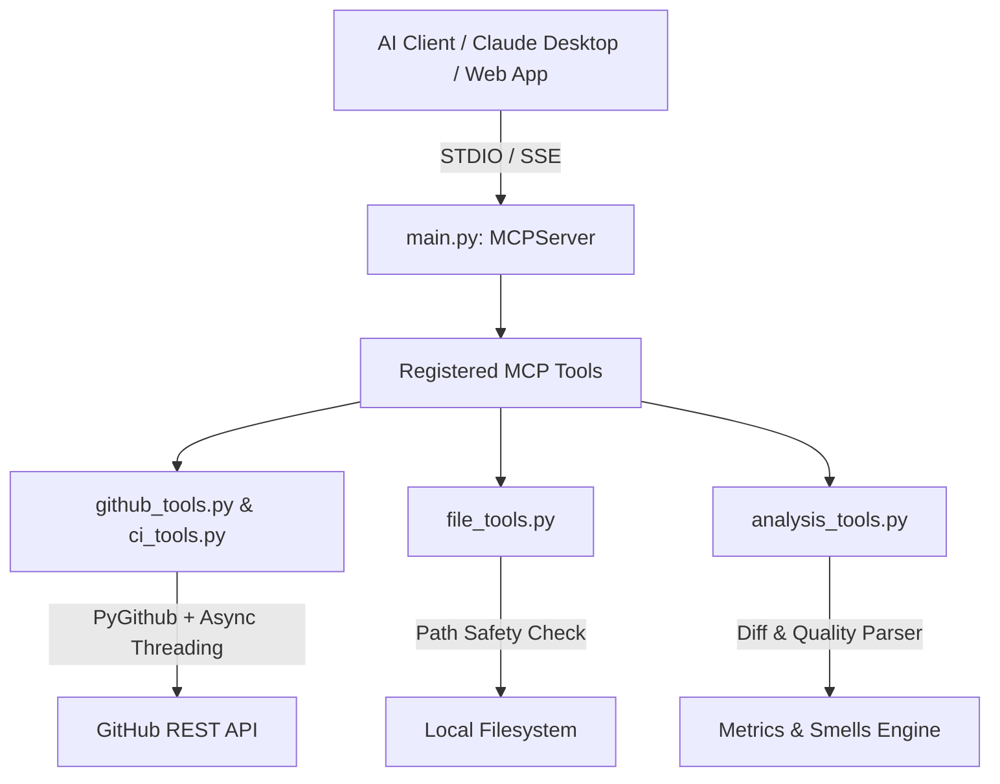

# GithubMCP Architecture Documentation

## Overview
**GithubMCP** is a Model Context Protocol (MCP) server built with Python 3.11+ and managed using `uv`. It serves as a developer assistant tool allowing AI models to securely interface with:
1. GitHub REST API workflows (repos, PRs, issues, code search, commits)
2. CI/CD Pipeline Status (GitHub Actions workflow runs & failure summaries)
3. Local Filesystem Operations (sandboxed file reading, directory tree, file search, context detection)
4. Code Analysis (PR/commit change categorization & code quality/secret smell detection)

## Modular Design

### 1. Configuration & Security Layer (`config.py` & `utils.py`)
- **Settings Management**: Handled via `pydantic-settings` to dynamically load values from `.env` or system environment variables.
- **Path Sandboxing**: All filesystem tools pass target paths through `validate_and_resolve_path()`. Paths are normalized, expanded (`~`), and validated against `ALLOWED_PATHS` to prevent path traversal vulnerabilities (`..`).
- **Async Execution & Rate-Limiting**: PyGithub API calls are executed asynchronously using `asyncio.to_thread` with exponential backoff retries when rate limit exceptions occur.

### 2. Transport Protocol Layer (`main.py`)
- Supports two primary MCP transport channels:
  - **STDIO Mode**: Standard Input/Output stream for CLI integration, Claude Desktop, or Cursor IDE.
  - **SSE Mode**: Server-Sent Events HTTP server for web-based clients and external agents.

### 3. Tool Suites
- **`github_tools.py`**: `search_repos`, `inspect_pr`, `inspect_issue`, `search_code`, `recent_commits`.
- **`ci_tools.py`**: `check_ci_status`.
- **`file_tools.py`**: `read_file`, `list_directory`, `search_local_files`, `get_project_context`.
- **`analysis_tools.py`**: `generate_change_summary`, `analyze_code_quality`.
